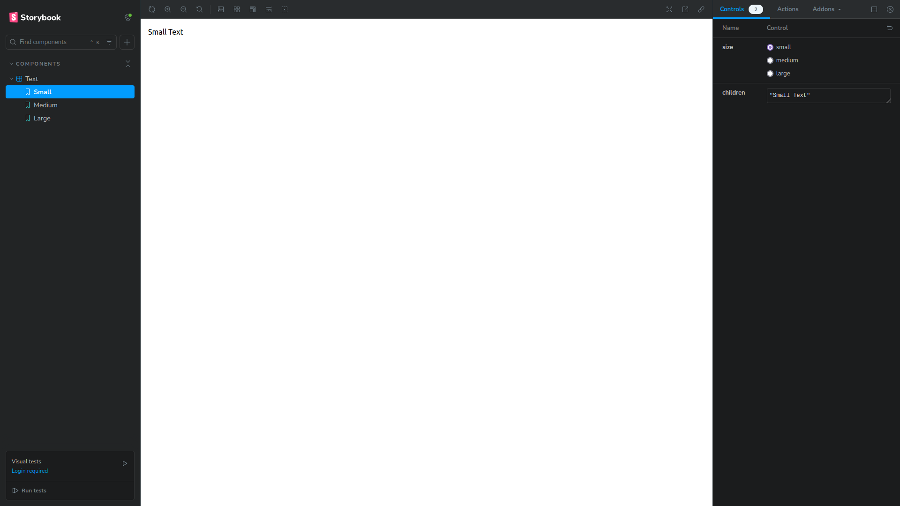

<h2 align='center'>:earth_americas: Vite.js Template :earth_americas:</h2>

<p align="center">
  <br>
  
  <br>
  <br>
</p>

## :pushpin: Requirements: :pushpin:

NodeJs: :link: https://nodejs.org/en/

---

#### :arrow_forward: Get Started:

1. Clone this repo

```sh
git clone https://github.com/Aleydon/React-Vite.git
```

2. Install NPM packages

```sh
npm install or yarn install
```

3.  Run this project

```sh
npm run dev or yarn dev
```

---

<h2>Template configuration:</h2>

- Jest + Testing Library for automated testing. :link: https://jestjs.io/ + https://testing-library.com/
- Storybook for component documentation. :link: https://storybook.js.org/
- Eslint + Prettier for code standardization and formatting. :link: https://eslint.org/ + https://prettier.io/
- Typescript for typing. :link: https://www.typescriptlang.org/
- Tailwind Css for styling components. :link: https://tailwindcss.com/
- HuskyJs for automatically lint your commit messages, code, and run tests upon committing or pushing. :link: https://typicode.github.io/husky/

---

<h2>Tests + Storybook:</h2>

- How to run tests:

```sh
npm run test or npm run test:watch
```

It has an example of tests with Jest + Testing-Library in _src/App.spec.tsx_

```ts
import { render, screen } from '@testing-library/react';

import App from './App';

describe('App Component', () => {
	it('should get the text hello world', () => {
		render(<App />);
		const hello = screen.getByText('Hello World');
		expect(hello).toBeDefined();
	});

	it('should get the text hello world in the component s heading', () => {
		render(<App />);
		const heading = screen.getByRole('heading', {
			name: 'Hello World'
		});
		expect(heading).toBeInTheDocument();
	});

	it('must get the link from the App component', () => {
		render(<App />);
		const link = screen.getByRole('link', { name: 'github.com/Aleydon' });
		expect(link).toBeDefined();
		expect(link).toHaveAttribute('target', '_blank');
		expect(link).toHaveAttribute('aria-label', 'github.com/Aleydon');
	});
});
```

---

- How to run storybook:

```sh
npm run storybook or yarn storybook
```

<p align="center">
  <br>
  
  <br>
  <br>
</p>

also has an example of using Storybook in the Text component in _src/components/Text/text.stories.tsx_

```ts
import type { Meta, StoryObj } from '@storybook/react';

import Text, { type TextProps } from '.';

const text: Meta<typeof Text> = {
	component: Text,
	title: 'Components/Text'
};

export default text;

export const Small: StoryObj<TextProps> = {
	args: {
		size: 'small',
		children: 'Small Text'
	}
};

export const Medium: StoryObj<TextProps> = {
	args: {
		size: 'medium',
		children: 'Medium Text'
	}
};
export const Large: StoryObj<TextProps> = {
	args: {
		size: 'large',
		children: 'Large Text'
	}
};
```
